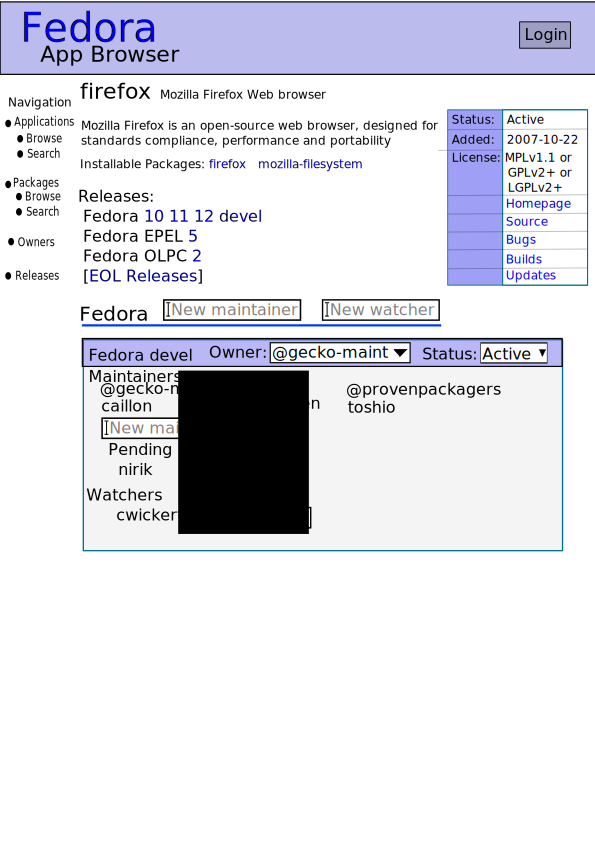

===================
New PackageDB WebUI
===================

:Author: Toshio Kuratomi
:Date: 16 Nov, 2009
:For Version: 0.6.x

The Package database has several UI issues that need to be solved.

.. contents::

--------------
Ownership Page
--------------

The Package Ownership page has been in use for a long time.  We now have a
better idea of what people like and dislike about it and we should adapt the
interface to correct those problems.  A few of the issues:

 * The interface has a bunch of EOL releases.  These are needed very very
   seldom so we should make viewing them a non-default choice.

   * It allows editing EOL releases.  Those can have no effect on
     things so we should remove that ability.

 * Adding a new maintainer is hard.

   * It requires selecting four individual acls.  Reduce this to one in the
     common case.

   * You must have the new maintainer sign up before you can approve them.
     Instead, the package owners should be able to say that they want to
     select them.

   * Groups can not be put on the commits list.  This means that, for
     instance, people can be in the perl-sig but not be able to commit to perl
     packages. (requires db work)

Mockup
======

Here's a mockup of the new UI:

-----------
Integration
-----------

The Package Database grew from a need to have a way for contributors to own
packages.  it's grown other features since then:

* Produces stats about package owners
* Has information about what packages are in what repositories
* Has user defined metadata (tags)
* Links to package bugs

These features currently don't have a well defined structure.  In some cases
they don't link to each other at all.  We ned to come up with some overall
navigation elements that can get the different elements organized and talking
to each other.
